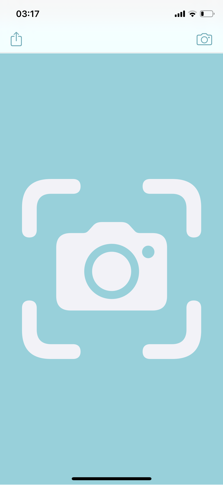

# QNota-IOS 

 

Front-end of IOS APP to help visually impaired people to use the cellphone camera to detect a money bill value.
 
<table><tr>
<td></td>
<td></td>
<td></td>
<td></td>
</tr></table>

## Instructions
- Download and installation is [not available yet](#).

## What does this do?
- Allows to phtograph a bill.
- Utilizes a CNN to classify the bill acording to its value.
- Returns the value of the bill to the user.

## Updates & Fixes
For a listing of new features & fixes please check out the [releases](https://github.com/rfrod/QNota-IOS/releases) page.
All features & bugs should also have a record in the issues page.

## Acknowledgements

The CNN implementantion is available at [QNota-CNN](https://github.com/rfrod/QNota-CNN).

## Local Development & Contribution

This is a app which has not being published yet.

The [wiki](https://github.com/rfrod/QNota-IOS/wiki) includes examples of common contributions such as bill images for the dataset.

## Suggestions & Donations

Please raise an issue in the [GitHub Issues](https://github.com/rfrod/QNota-IOS/issues) page.

This is a hobby project which evolved over time, if you found this useful, or want to inspire development you can always donate to the addresses below:

- Bitcoin 
`3BKBMRvp67Mh3fJbhhSZ9YPCrCsz3vGaRp`

- cBRL (min CR$ 20,00)
`0xAF4a0dc70F1b1DB840cBC9928d9676A0b6E47841`
